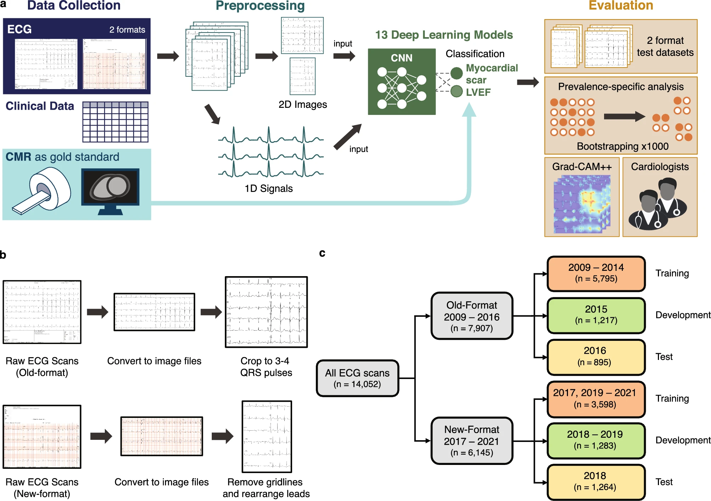
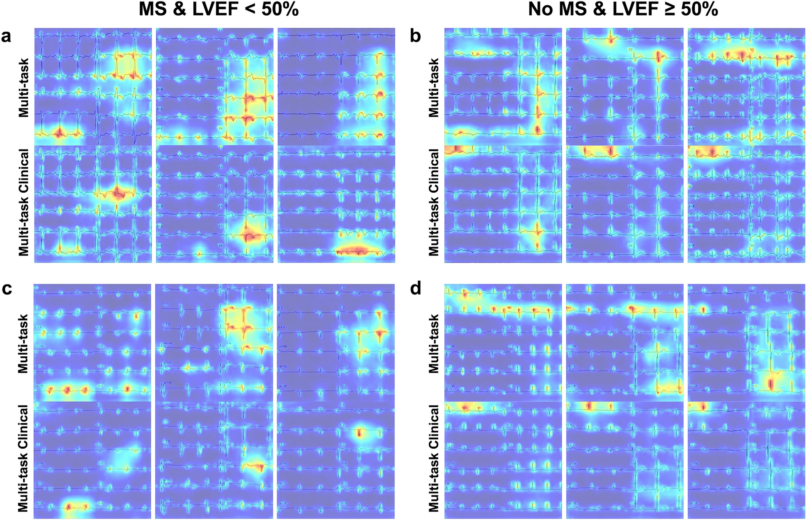

# Myocardial scar and left ventricular ejection fraction classification for electrocardiography image using multi-task deep learning

Published at [Scientific Reports](https://www.nature.com/articles/s41598-024-58131-6)

Myocardial scar (MS) and left ventricular ejection fraction (LVEF) are vital cardiovascular parameters, conventionally determined using cardiac magnetic resonance (CMR). However, given the high cost and limited availability of CMR in resource-constrained settings, electrocardiograms (ECGs) are a cost-effective alternative. We developed computer vision-based multi-task deep learning models to analyze 12-lead ECG 2D images, predicting MS and LVEF < 50%. Our dataset comprises 14,052 ECGs with clinical features, utilizing ground truth labels from CMR. Our top-performing model achieved AUC values of 0.838 (95% CI 0.812–0.862) for MS and 0.939 (95% CI 0.921–0.954) for LVEF < 50% classification, outperforming cardiologists. Moreover, MS predictions in a prevalence-specific test dataset recorded an AUC of 0.812 (95% CI 0.810–0.814). Extracted 1D signals from ECG images yielded inferior performance, compared to the 2D approach. In conclusion, our results demonstrate the potential of computer-based MS and LVEF < 50% classification from ECG scan images in clinical screening offering a cost-effective alternative to CMR.



We applied Grad-CAM++ to visualize the areas of ECG images that influenced the model decision. Figure below shows examples of heatmaps generated on top of the ECGs for multi-task and multi-task with clinical model.



## Repository structure

- `mtecg`: core library for multi-task MS and LVEF classification
- `notebooks`: Jupyter notebooks for dataset statistics, evaluation, and figures. See [notebooks/README.md](notebooks/README.md) for more details.
- `scripts`: scripts for data preprocessing and model training
- `app`: frontend and backend code for the screening application

## Multi-task ECG Classification

`mtecg` contains a core library for multi-task MS and LVEF classification. This include the preprocessing pipeline,
model architecture, and evaluation scripts.

## Experiments

To reproduce the experiments in the paper, you can use the scripts in the `scripts` folder.
There are example bash scripts for each part of the experiment.

**Extraction of ECG from PDF**
[scripts/preprocess_data.py](scripts/preprocess_data.py):

```bash
python preprocess_data.py \
	--label_excel_path "../datasets/siriraj_data/ECG_MRI/ECG_MRI_80_training_10_development_for_aj_my_220707.1.xlsx" \
	--parent_dir "../datasets/siriraj_data/ECG_MRI" \
	--save_dir "../datasets/siriraj_data/ECG_MRI_images" \
	--label_save_path "../datasets/siriraj_data/ECG_MRI/ECG_MRI_80_training_10_development_220707_image_labels.xlsx"
```

Here,
`label_excel_path` is the path to the excel file containing the PDF file names, the labels (MS and LVEF), and the clinical features.
`parent_dir` is the parent directory of the PDFs containing the ECGs.
`save_dir` is the directory to save the extracted and preprocessed ECG images.
`label_save_path` is the path to save the new label file with the ECG image paths.

**Training with the ECG images**
[scripts/train.py](scripts/train.py):

```bash
python train.py --config_path "configs/multi-task.json"
```
See [configs/multi-task.json](configs/multi-task.json) for the configuration file.

## Usage
Here we provide an example of how to use the trained model to predict MS and LVEF from an ECG image.
Please note that the input ECG image should be a 2D image with similar lead arrangement as the training data.

```python
import torch
from mtecg.classifier import ECGClassifier

ecg_classifier = ECGClassifier(
    "trained_models/multi-task/",
    model_class="multi-task",
    device="cuda" if torch.cuda.is_available() else "cpu",
    round_probabilities=True
    )
output_dict = ecg_classifier.predict(ecg_image)
```
For multi-task models, the `output_dict` will have the following structure (in this example, the model predicts negative for both MS and LVEF):

```python
{
    "scar": {
        "prediction": 0,
        "probability": {
          "negative": 0.7,
          "positive": 0.3,
        }
    },
    "lvef": {
        "prediction": 0,
        "probability": {
          "negative": 0.8,
          "positive": 0.2,
        }
    }
}
```

## Screening application

`app` folder contains the frontend and backend code for the screening application (in Thai).
We design a UI for the application using [NEXT.js](https://nextjs.org/) and implement the backend
using [FastAPI](https://fastapi.tiangolo.com/).


## Citation

If you use our repository or our study, please cite us using the following Bibtex

```
@article{boribalburephan2024myocardial,
  title={Myocardial scar and left ventricular ejection fraction classification for electrocardiography image using multi-task deep learning},
  author={Boribalburephan, Atirut and Treewaree, Sukrit and Tantisiriwat, Noppawat and Yindeengam, Ahthit and Achakulvisut, Titipat and Krittayaphong, Rungroj},
  journal={Scientific Reports},
  volume={14},
  number={1},
  pages={7523},
  year={2024},
  publisher={Nature Publishing Group UK London}
}
```